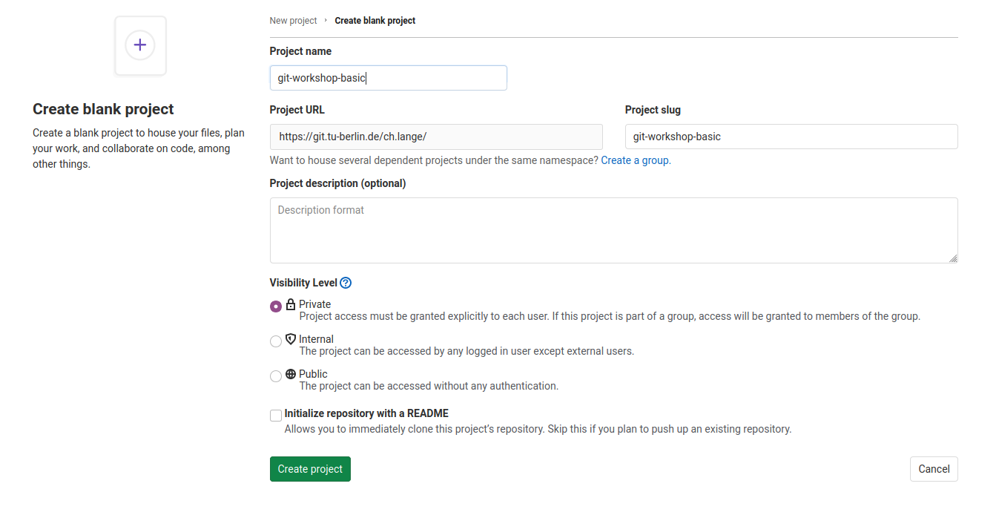

.. _new-repository:

=====================
Creating a Repository
=====================

.. contents:: Steps

The basic idea is to create a repo on the remote server. Then we create some
content for the repository locally and finally we want to sync this content to
the remote server.

Create Project on GitLab
________________________

First of all you want to create a repository on GitLab/GitHub. Therefore, go to
the URL of your GitLab Server, i.e.
https://git.tu-berlin.de/kiwi-git-workshops.   Then you click on
**New Project** and select **Create blank project**. Afterwards you may choose a
name for your repository

and click **Create project**.
Now we created an empty project on the remote server.

Use Project Template
____________________
Now we create a folder with some code on our local machine.
Therefore we use a template via the following steps:

1. Open a terminal

2. Install the python package cookiecutter

   .. code-block::

      pip3 install cookiecutter

3. Use *cd* to navigate to the directory that you want to start a repository.

   .. code-block::

      cd path/to/your/git-projects

4. Create your python package with

   .. code-block::

       cookiecutter https://github.com/spirousschuh/cookiecutter-git-workshop-testing

5. Specify the template parameter. Now you will see

   .. code-block::

      author_name [Josephine Doe]:

   This is a question. "What should be the name of the author?" and requires
   your input. You can either press *Enter*, then the author_name is set to the
   default option Josephine Doe. Or you can enter another name.

6. Answer the questions that will be prompted to you or press *Enter* to choose
   the default value. You do not need to reveal
   your real data, as it is a toy project anyway. But you could choose answers
   like these:

   .. _project-name:

   .. image:: ../images/questions.png

   Pay attention at the third question. The answer to that question will be
   the name of the folder where you can find your package later.

   Now we created a folder of code locally.

Sync Local and Remote Repository
___________________________________

In this section we will syncronize our local folder with the remote git server.
Right know they do not know about each other.

1. Go the folder that you just created in the last step

   .. code-block::

      cd my_image_package

   The name of the folder corresponds to your answer to the question

   .. code-block::

      package_name [git_workshop_testing]: my_image_package

2. Go back to your browser and open the remote server url
   (https://git.tu-berlin.de). Then go to the project
   that you just created in the section `Create Project on GitLab`_.
   As it is an empty project the landing page should look like this:

   .. image:: ../images/project_setup.png

3. Follow the step that are displayed under **Git global setup** (first red box)
   one by one, i.e. you copy each line to your terminal and press *Enter*.

4. Follow the steps you find in the section **Push an existing folder**
   (second red box). You need to replace `cd existing_folder` with the
   project-name_ you chose in step 6. In case you forgot the package name you
   can check it with `ls -l` which displays the content of the current
   directory.
   (if you get an error like `error: src refspec main does not match any` you
   need to replace main with master)

5. Install your new package in editable mode

   .. code-block::

      pip install -e .

6. Go to your project webpage `https://git.tu-berlin.de/your_name/your_project`.
   When you see a basic README.md file you succeeded.
