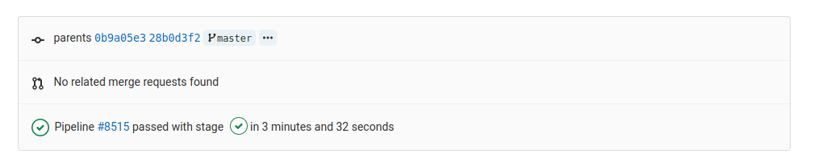

======================
Continuous Integration
======================

Idea
____

Continuous Integration is the traffic lights of software development. It checks
the traffic for you, to see if you are good to go. Therefore it automatically
checks things like

* running all unit tests
* tries different system configurations
* checks coding conventions

You can extent the checks to whatever you like.
When all checks ran successfully you get a green light.

Rules
_____

For continuous integration to work properly, it is crucial to enforce the
following rules

* the main / master branch is protected
* the only way to alter the main / master branch is a Merge Request
* Just merge when lights are green

Seting up CI for your repository is not straight forward. Therefore for today's
workshop it is enabled automatically, as long as you created your repo in the
right group (https://git.tu-berlin.de/kiwi-git-workshops).

For more information on how to setup CI, please take a look here
https://docs.gitlab.com/ee/ci/introduction/.